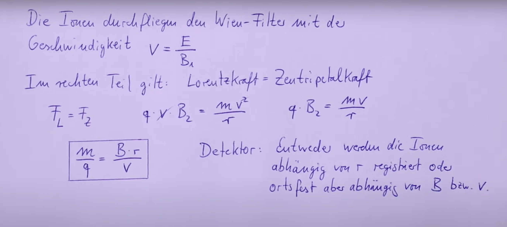

## Die fünf Systeme der Braun´sche Röhre

[[Materiellen/Stunde 10 die Braun´sche Röhre 23_24.pdf]]
### Emittierendes & Bündelendes System (1- & 2-System)

1. **Kathode und Elektronenemission**
   - Um Elektronen zu emittieren, wird eine Heizspannung U(h) an einer Glühwendel-Kathode(negative Seite) angelegt.
   - Die emittierten Elektronen befinden sich in einer Raumladungszone.

2. **Elektronenbündelung**
   - Zwischen der Wand des Wehnelt-Zylinders und der Kathode werden die Elektronen durch ein elektrisches Feld gebündelt.
	   - Dies bedeutet, dass Elektronen in diesem Bereich aufgrund des elektrischen Feldes dazu neigen, sich zu konzentrieren oder zu fokussieren. Das elektrische Feld übt eine Kraft auf die Elektronen aus, die sich in eine Richtung bewegen, und dieser Effekt bewirkt, dass die Elektronen näher beieinander bleiben oder "gebündelt" werden, anstatt sich zufällig zu verteilen.

### Beschleunigendes System (3-System)

3. **Beschleunigungssystem**
   - Elektronen werden zwischen Anode und Kathode im elektrischen Feld durch die Beschleunigungsspannung U(B) zur Loch Anode hinbeschleunigt.

	 *Geschwindigkeitsberechnung*
	   - Herleitung der Geschwindigkeit eines Elektrons im elektrischen Feld:
  $$E_{el,pot}\left(d\right)=E\left(kin\right)$$
   $$e\cdot U\left(B\right)=\frac12\cdot m\cdot V^2$$
   $$V=\sqrt{\frac{2\cdot U\left(B\right)\cdot e}{m}}$$
	   - *e* ist die Ladung des Elektrons (1,6 * 10^-19 C).
	   - *m* ist die Masse des Elektrons (9,1 * 10^-31 kg).
	   - *UB* ist die Spannung der Beschleunigung
	   
	Wobei potentielle und kinetische Energie gleichgesetzt werden können, da durch die Beschleunigung die Elektronen ihre potentielle Energie in Kinetische Energie umwandeln.

### Ablenkendes System (4-System)

4. **Ablenkungssystem**
   - Elektronen werden durch das elektrisches Feld zwischen den Kondensatorplatten erst vertikal und dann horizontal zu den positiven Platten hin abgelenkt.
   - Die Stärke der Ablenkung hängt von der Ablenkungsspannung U(p) ab.

### Anzeigendes System (5-System)

5. **Leuchtschirm und Lichtemission**
   - Elektronen treffen auf den Leuchtschirm und geben ihre Energie an die Leuchtschicht ab.
   - Die angeregten Atome des Leuchtschirms emittieren nach kurzer Zeit elektromagnetische Wellen, die als grünes Licht sichtbar sind. Die Farbe des Lichts ist von der Beschichtung abhängig.
### Bewegung in X-Richtung

Gleichförmige Bewegung mit konstanter Geschwindigkeit nach der Anode.
$$S_{_{x}}=V_{x}\cdot t$$

- für $V_{x}$  gilt: $V_{x}=\sqrt{\frac{2\cdot e\cdot U_{B}}{m}}$
### Bewegung in Y-Richtung
- Die Bahnkurve ist ein Arm einem Parabel.
- Die Bahnkurve lässt sich mit der Formel: 
$$S_{y1}=\frac14\cdot\frac{U_{p}}{U_{B}}\cdot\frac{L^2}{d}$$
Wobei:
-  *Sy1* die Strecke in y-Richtung bis zum Ende der Platten
- *Up* die Spannung der Ablenkung ist.
- $U_B$ die Spannung der Beschleunigung ist.
- *L* die Länge des Kondensators ist.
- *d* der Abstand zwischen den Platten ist.
$$S_{y2}=\frac12\cdot\frac{U_{p}}{U_{B}}\cdot\frac{L\cdot s}{d}$$
Wobei:
+ *Sy2* die Strecke in y-Richtung vom Ende der Platten bis zu der Leuchtschirm ist.
+ *Up* die Spannung der Ablenkung ist.
- *UB* die Spannung der Beschleunigung ist.
- *L* die Länge des Kondensators ist.
- *s* die Strecke zwischen Kondensator Platten und Leuchtschirm ist.
- *d* der Abstand zwischen den Platten ist.

$$S_{gesamt}=\frac12\cdot\frac{U_{p}}{U_{B}}\cdot\frac{L}{d}\cdot\left(\frac12\cdot L+s\right)$$
Wobei:
+ *S Gesamt* **Sy1** + **Sy2** ist.
+ *Up* die Spannung der Ablenkung ist.
- *UB* die Spannung der Beschleunigung ist.
- *L* die Länge des Kondensators ist.
- *s* die Strecke zwischen Kondensator Platten und Leuchtschirm ist.
- *d* der Abstand zwischen den Platten ist.

beschreiben, wobei *L* dann durch *X* ersetzt werden muss und *X* die Positionen innerhalb des Kondensator auf der horizontalen Linie angibt. 

Es ist wichtig zu beachten, dass die elektrische Kraft mit der Beschleunigungskraft (Erdanziehungskraft aber für die Elektronen im elektrischen Feld) gleichgesetzt werden kann, aufgrund von Analogie Betrachtung (Siehe PDF für die Formel Ausgleichung).

### Zusammenfassung
Die Bewegung der Elektronen in einem elektrischen Feld wird durch verschiedene Systeme gesteuert, darunter das emittierende, bündelnde, beschleunigende, ablenkende und anzeigende System. Die Geschwindigkeit der Elektronen kann durch die gegebene Formel bis vor der Ablenkungssystem berechnet werden.

## Das Massenspektrometer (gut zu wissen, aber nicht direkt Abitur relevant)

Das Massenspektrometer dient der Unterscheidung zwischen Ionen unterschiedlicher Massen bzw. spezifischer Ladungen.
### Skizze

### Erklärung
Zunächst werden Atome oder Moleküle ionisiert und anschließend durch das elektrische Feld zur Lochanode hin beschleunigt. Die beschleunigten Ionen durchlaufen anschließend den **Wien-Filter**, der aus einem **Plattenkondensator** und einem senkrecht dazu gerichteten **Magnetfeld** besteht.

  

Nur Ionen mit einer bestimmten Geschwindigkeit, für die elektrische Kraft und Lorentzkraft im Gleichgewicht sind, passieren den Filter und bewegen sich geradlinig weiter. Diese Ionen gelangen in ein zweites Magnetfeld, das als **Ablenkfeld** dient. Hier werden sie aufgrund der **Lorentzkraft** auf **kreisförmige Bahnen mit unterschiedlichen Radien** abgelenkt, wobei der Radius von der **Masse der Ionen** abhängt. Ein größerer Radius deutet auf eine größere Masse hin.

### Formlen

- Formel für Masse, q oder v werden umgeformt.

## Das Helmholz-Spulenpaar (Nicht Abi relevant)

### Formeln

## Zyklotron (Nicht Abi Relevant) 

