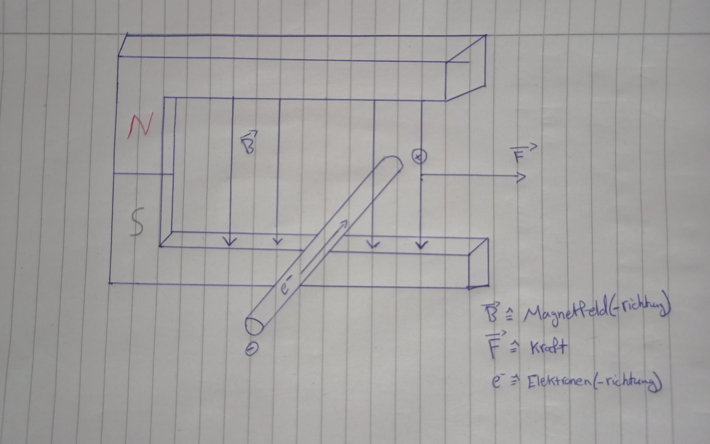
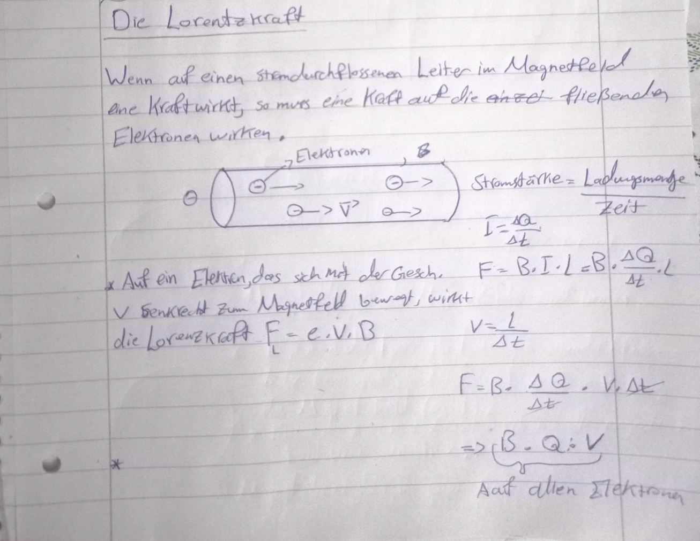

# Magnetismus

> **Fundamentaler Zusammenhang**
> Elektrischer Strom erzeugt ein Magnetfeld, aber ein sich bewegendes Magnetfeld kann elektrischen Strom erzeugen.

## Grundlagen des Magnetismus

Die Erde besitzt ein **Magnetfeld**. Der magnetische Südpol liegt etwa am geographischen Nordpol, der magnetische Nordpol etwa am geographischen Südpol.

Ein frei drehbares Magnet ist ein **Kompass**. Der Pol, der zum geographischen Nordpol zeigt, heißt **Nordpol** (Rot), der nach Süden zeigt, heißt **Südpol** (grün).

## Magnetfelder und ihre Eigenschaften

### Überlagerung von Magnetfeldern

1. **Additive Überlagerung (Nordpol an Südpol):** Wenn der Nordpol eines Magneten dem Südpol eines anderen Magneten angenähert wird, addieren sich die Magnetfelder. In diesem Fall verstärken sie sich gegenseitig, wodurch die Kraft zwischen den Magneten zunimmt.

2. **Subtraktive Überlagerung (Nordpol an Nordpol oder Südpol an Südpol):** Wenn der Nordpol eines Magneten dem Nordpol eines anderen Magneten oder der Südpol dem Südpol angenähert wird, subtrahieren sich die Magnetfelder. In diesem Fall schwächen sie sich gegenseitig ab, wodurch die Kraft zwischen den Magneten verringert wird.

### Eigenschaften der Feldlinien

- **Feldlinien** veranschaulichen die Richtung und Stärke des Magnetfelds. Sie zeigen in die Richtung des Nordpols einer Kompassnadel.
- **Homogenes Feld**: Geradlinige und parallele Feldlinien deuten auf ein homogenes Feld hin.
- **Feldstärke**: Je größer die Dichte der Feldlinien ist, desto höher ist die magnetische Feldstärke.

## Elektrischer Strom erzeugt Magnetfelder

### Magnetfeld um einen Leiter

Wenn Strom durch einen Leiter fließt, bildet sich um ihn herum ein magnetisches Feld, dessen Feldlinien geschlossene Kreise um den Leiter herum bilden.

### Magnetfeld einer Spule

Wird ein Draht spiralförmig um einen Zylinder gewickelt und von Strom durchflossen, entsteht um jede Windung gemäß der **Linken-Faust-Regel** ein Magnetfeld. Die Magnetfelder zwischen den Windungen heben sich gegenseitig auf, während sie oberhalb und unterhalb der Windungen in die gleiche Richtung zeigen. Dadurch entsteht ein **homogenes Magnetfeld** axial durch die Spule hindurch, dessen Stärke und Orientierung von der **Stromflussrichtung und der Wicklungsart** des Drahtes bestimmt werden.

## Leiterschaukelversuch (Hufeisenmagnet)

Auf einem im Magnetfeld senkrecht zu den Feldlinien stehenden stromdurchflossenen Leiter wirkt senkrecht zur Stromrichtung und senkrecht zur Magnetfeldrichtung eine Kraft.

### Kraftrichtung

- Die Kraft ist maximal, wenn die Elektronenrichtung senkrecht zu den magnetischen Feldlinien steht.
- Die Kraft ist nicht vorhanden, wenn der Leiter parallel zu den Feldlinien steht.

### Drei-Finger-Regel

- **Daumen**: Elektronenrichtung oder die Ursache (bei menschlicher Bewegung des Magnets oder des Leiters ist die Ursache die Bewegungsrichtung)
- **Zeigefinger**: Magnetfeldrichtung
- **Mittelfinger**: Kraftrichtung

## Magnetische Feldstärke und Flussdichte

### Die magnetische Flussdichte B

Während die elektrische Feldstärke E die Kraft pro Ladungseinheit beschreibt, gibt die magnetische Flussdichte B die Kraft an, die auf einen Leiter mit Stromstärke I und Länge l im Magnetfeld wirkt.

$$\boxed{B = \frac{F}{I \cdot l}}$$

wobei:

- $B$: magnetische Flussdichte in $\frac{N}{A \cdot m} = T$ (Tesla)
- $F$: Kraft auf den Leiter in $N$ (Newton)
- $I$: Stromstärke in $A$ (Ampere)
- $l$: Leiterlänge im Magnetfeld in $m$ (Meter)

### Magnetfeld einer langen Spule

Das Magnetfeld innerhalb einer langen Spule hängt von der Stromstärke, der Windungszahl und der Spulenlänge ab:

$$\boxed{B = \mu_0 \cdot \mu_r \cdot I \cdot \frac{N}{l}}$$

oder alternativ:

$$\boxed{B = \mu_0 \cdot \mu_r \cdot n \cdot I}$$

wobei:

- $N$: Anzahl der Windungen
- $l$: Länge der Spule in $m$
- $n = \frac{N}{l}$: Windungsdichte in $\frac{1}{m}$
- $\mu_0 = 1,257 \cdot 10^{-6} \frac{Vs}{Am}$: magnetische Feldkonstante
- $\mu_r$: relative Permeabilität (Das Material der Spule, wobei für Luft $\mu_r = 1$ ist)

## Die Stromwaage und Lorentzkraft

### Funktionsweise der Stromwaage

Die Stromwaage misst die Kraft, die auf einen stromdurchflossenen Leiter in einem Magnetfeld wirkt.

### Versuchsaufbau

- Ein Leiter wird in ein homogenes Magnetfeld B zwischen die Pole eines Elektromagneten gebracht.
- Der Leiter ist Teil eines geschlossenen Stromkreises, durch den eine einstellbare Stromstärke I fließt.
- Die durch das Magnetfeld auf den Leiter ausgeübte Kraft wird mit der Waage gemessen.
- Zur Untersuchung der Abhängigkeit der Kraft werden I und die Leiterlänge l variiert.

### Beobachtung

- Erhöht man die Stromstärke I, steigt auch die auf den Leiter wirkende Kraft.
- Die Richtung der Kraft hängt von der Orientierung des Magnetfeldes und der Stromrichtung ab.

### Erklärung

Ein stromdurchflossener Leiter erzeugt ein eigenes Magnetfeld gemäß der **Linken-Faust-Regel**. Befindet sich der Leiter im Magnetfeld eines Elektromagneten, so überlagern sich die beiden Magnetfelder. Wenn die Magnetfelder in die gleiche Richtung zeigen, stoßen sie sich ab, wodurch der Leiter nach oben gedrückt wird. Sind die Magnetfelder entgegengesetzt ausgerichtet, ziehen sie sich an, und der Leiter wird nach unten gezogen.

> **Merke**: Ist ein stromdurchflossener Leiter senkrecht zu einem Magnetfeld ausgerichtet, so wirkt auf diesen Leiter eine Lorentzkraft.

### Lorentzkraft-Formeln

$$\boxed{F_{L} = B \cdot I \cdot l}$$
$$\boxed{F_{L} = e \cdot v \cdot B}$$

wobei:

- $B$: Magnetische Flussdichte (in Tesla, $T$)
- $I$: Stromstärke (in Ampere, $A$)
- $l$: Länge des Leiters im Magnetfeld (in Meter, $m$)
- $e$: Elementarladung eines Elektrons (in Coulomb, $C$)
- $v$: Geschwindigkeit eines Elektrons (in Meter pro Sekunde, $m/s$)

### Rechteckige stromdurchflossene Leiter

Für einen rechteckigen, stromdurchflossenen Leiter gilt:

- **Effektive Leiterlänge und Form**: Die Form der Leiterschleife spielt für die resultierende Kraft nur eine Rolle, wenn sie die effektive Leiterlänge in der Richtung beeinflusst, die senkrecht zum Magnetfeld steht.
- **Vertikale Leitersegmente**: Die vertikalen Abschnitte der Schleife erfahren nach der Drei-Finger-Regel entgegengesetzte Kräfte, da der Strom in entgegengesetzte Richtungen fließt.
- **Horizontale Segmente**: Die Lorentzkraft wirkt nur auf die horizontalen Abschnitte der Schleife.

### Elektronenstrahlablenkröhre

Dies dient zum Nachweis von Lorentzkraft und der Elektronenbahn.

## Der Hall-Effekt

### Beobachtung

- Auf ein Germanium-Hallplättchen wird ein Magnet gestellt und ein Strom fließt durch das Plättchen. Eine Spannung ist messbar.
- Je höher die Stromstärke, desto höher ist die Spannung bei gleicher B-Feldstärke.
- Je höher die B-Feldstärke, desto höher die Spannung bei gleicher Stromstärke.
- Bei Umkehrung des B-Feldes wird die Polung der Spannung umgekehrt.

### Erklärung

Wenn Strom durch ein **Hall-Plättchen** fließt und ein Magnetfeld senkrecht zur Stromrichtung wirkt, erfahren die Elektronen eine Ablenkung aufgrund der **Lorentzkraft**. Diese Ablenkung bewirkt, dass sich die Elektronen auf einer Seite der Platte ansammeln, was eine **Ladungstrennung** und somit eine **Hall-Spannung** $U_H$ erzeugt.

Die Richtung der Ablenkung lässt sich mit der **Drei-Finger-Regel der linken Hand** bestimmen. Durch eine höhere Stromstärke oder ein stärkeres Magnetfeld wird die erzeugte Hall-Spannung größer. Diese Ladungstrennung erzeugt ein elektrisches Feld $E_H$, das eine entgegengesetzte **elektrische Kraft** auf die Elektronen ausübt.

Sobald die **Lorentzkraft** und die **elektrische Kraft** im Gleichgewicht sind, bleibt die Hall-Spannung $U_H$ konstant.

### Hall-Effekt Formeln

1. **Allgemeine Formel für die Hall-Spannung:**
   $$\boxed{U_H = B \cdot b \cdot v}$$

2. **Formel unter Verwendung des Stroms:**
   $$\boxed{U_H = B \cdot b \cdot \frac{I \cdot l}{N \cdot e}}$$

3. **Formel unter Verwendung der Hall-Konstanten:**
   $$\boxed{U_H = R_H \cdot \frac{I \cdot B}{d}}$$

wobei:

- $U_H$: Hall-Spannung
- $B$: Magnetische Flussdichte
- $b$: Abstand zwischen den Kontakten, an denen die Hall-Spannung gemessen wird
- $v$: Geschwindigkeit der Elektronen
- $I$: Elektrischer Strom
- $l$: Länge des Leiters parallel zur Magnetfeldrichtung
- $N$: Anzahl der Ladungsträger pro Volumeneinheit
- $e$: Elementarladung (Ladung eines Elektrons)
- $R_H$: Hall-Konstante (materialabhängig)
- $d$: Dicke des Leiters parallel zur Magnetfeldrichtung

## Fadenstrahlrohr

### Aufbau und Funktionsweise

> **Hinweise**
> - Je größer die spezifische Ladung, desto stärker wird das Teilchen durch elektromagnetische Felder beeinflusst.
> - Eine größere spezifische Ladung führt zu einer engeren Kreisbahn.

### Entstehung der Bahnkurve

Durch den **glühelektrischen Effekt** werden Elektronen aus der Kathode emittiert und durch das elektrische Feld zur Anode hinbeschleunigt. Der **Elektronenstrahl** entsteht in einem gasgefüllten Kolben, der von zwei **Helmholtz-Spulen** umgeben ist. Durch den Stromfluss in den Spulen wird ein **homogenes Magnetfeld** erzeugt.

Beim Eintritt in dieses Magnetfeld erfahren die Elektronen in jedem Punkt der Bahn die **Lorentzkraft**, die senkrecht zur Bewegungsrichtung der Elektronen und zur Magnetfeldrichtung steht. Die Lorentzkraft wirkt als Zentripetalkraft und führt zur **kreisförmigen Bewegung**.

### Beobachtungen der Kreisbahn

1. **Reduzierte Beschleunigungsspannung**: Der Kreis wird kleiner
2. **Reduzierte Magnetfeldstärke**: Der Kreis wird größer
3. **Gedrehte Röhre**: Entsteht eine Schraubenbahn

### Fadenstrahlrohr-Formeln

**Beschleunigungsspannung $U_a$:**
Die Geschwindigkeit wird durch Gleichsetzen von $E_{kin}$ und $E_{pot}$ bestimmt:

$$\boxed{v = \sqrt{\frac{2 \cdot e \cdot U_a}{m}}}$$

**Bestimmung der spezifischen Ladung $\frac{e}{m}$:**

$$F_L = F_Z$$
$$e \cdot v \cdot B = \frac{m \cdot v^2}{r}$$
$$\boxed{\frac{e}{m} = \frac{2 \cdot U_a}{B^2 \cdot r^2}}$$

**Herleitung des Radius:**

$$\boxed{r = \frac{m \cdot v}{e \cdot B}}$$

### Aufgabe

## Wien-Filter

### Aufbau

### Funktionsweise

Die Ionen passieren den **Wien-Filter** (auch Geschwindigkeitsfilter genannt), der aus einem **Plattenkondensator** und einem senkrecht dazu gerichteten **Magnetfeld** besteht. Während die Ionen den Wien-Filter durchqueren, wirken zwei entgegengesetzte Kräfte auf sie:

- Die **Lorentzkraft** durch das Magnetfeld lenkt die Ionen in eine Richtung
- Die **elektrische Kraft** durch das Feld des Plattenkondensators wirkt in die entgegengesetzte Richtung

Nur Ionen mit einer **bestimmten Geschwindigkeit** erfahren ein Kräftegleichgewicht, bewegen sich **geradlinig** weiter und passieren den Filter ungehindert.

### Wien-Filter Formeln

Für die Teilchen, die den Filter mit der Geschwindigkeit $V_0$ gerade durchfliegen, muss gelten:

$$F_{el} = F_L$$
$$q \cdot E = q \cdot V_0 \cdot B$$
$$\boxed{V_0 = \frac{E}{B}}$$

**Geschwindigkeitsabhängigkeit:**

- ist $V > V_0$, dann dominiert die $F_L$
- ist $V < V_0$, dann dominiert die $F_{el}$

